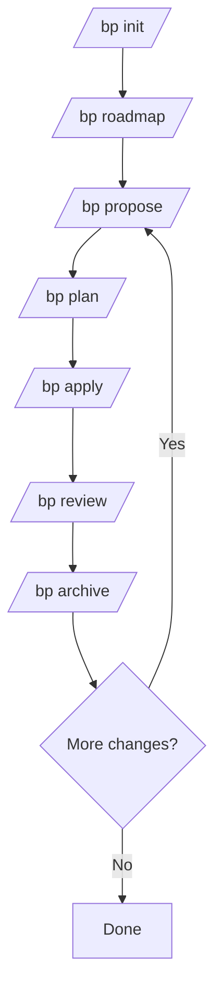

# Blueprint

**Spec-driven development workflow for AI coding agents.**

Write behavioral specs once, let agents implement against them. Lightweight artifact-based progress — no state machine, no formal grammars. Delta specs capture behavioral contracts at the change level and merge into a global spec on archive.

Inspired by OpenSpec-style structured specifications, adapted for AI-agent-driven development with 4 specialized sub-agents (planner, executor, reviewer, codebase-scanner).

## Why

AI coding agents are powerful but unpredictable — requirements exist only in chat history, context rots across long sessions, and there's no repeatable workflow. Blueprint solves this:

- **Spec alignment before code.** Requirements, design decisions, and behavioral contracts are captured as structured artifacts, not chat.
- **Fresh-context sub-agents.** Heavy work (planning, implementation, review) delegates to spawned sub-agents with clean context — no rot.
- **Artifact-based CLI.** `bp continue` detects progress from file existence. No state machine, no lock files — just check what's on disk.
- **Lightweight validation.** Artifacts are checked for required sections, valid IDs, and unreplaced placeholders — no formal grammar compilation.
- **Delta-spec merge.** Change-level behavioral contracts (ADDED/MODIFIED/REMOVED) merge into global specs on archive with SHA-256 fingerprinting.

## Core Concepts

```
Roadmap (living document) → Change (spec-driven unit)
```

| Entity | Description |
|--------|-------------|
| **Roadmap** | Living document (`bp/roadmap.md`) defining milestones, phases, and planned changes |
| **Change** | Implementation unit with structured artifacts — goes through propose → plan → apply → review → archive |
| **Spec** | Behavioral contracts stored in `bp/specs/<domain>/spec.md` — source of truth maintained via delta merges |

### Architecture

```
2-layer: Roadmap (what's planned) + Change (what's being built)
4 sub-agents: planner (design + tasks + delta specs + context.jsonl)
              executor (TDD waves, isolated)
              reviewer (triple review gate)
              codebase-scanner (brownfield spec bootstrap)
8 artifact templates: proposal, design, tasks, spec, review, roadmap, config, global-spec
```

## Quick Start

```bash
npm install -g @hyperion2144/blueprint
mkdir my-project && cd my-project
bp init
```

```bash
# Start a change
bp propose my-change
bp plan my-change
bp apply my-change
bp review my-change
bp archive my-change

# Auto-advance through the next step
bp continue

# Setup roadmap
bp roadmap
```

## CLI Reference

| Command | Description |
|---------|-------------|
| `bp init` | Initialize project structure (`bp/config.yaml`, directory skeleton) |
| `bp roadmap` | Create or update the roadmap (`bp/roadmap.md`) |
| `bp propose <name>` | Create a change proposal — define intent, scope, deliverables |
| `bp plan <name>` | Dispatch the planner sub-agent — produce design, tasks, delta specs |
| `bp apply <name>` | Dispatch executor sub-agents — TDD wave-based implementation |
| `bp review <name>` | Dispatch reviewer sub-agent — triple review (spec + quality + goal) |
| `bp archive <name>` | Archive a completed change — delta-spec merge + code backfill |
| `bp continue` | Auto-advance — detect current state from artifacts, suggest next step |


| Command | Description |
|---------|-------------|
| `bp commit <name>` | Generate atomic commits for completed tasks |
| `bp template <type>` | Generate an artifact template (proposal, design, tasks, spec, review, roadmap, config, global-spec) |
| `bp list` | List active changes, archived changes, spec domains |
| `bp dispatch <role>` | Output platform-specific sub-agent dispatch instructions |
| `bp config [list\|set]` | View or modify project configuration |
| `bp context <name>` | Check change context completeness |
| `bp state <name>` | Show artifact-based current state |
| `bp update` | Regenerate all platform files to match latest templates |
| `bp schema` | Manage spec schema |

## Validation System

Artifacts are validated structurally, not against formal grammars:

| Artifact | Validation checks |
|----------|-------------------|
| **proposal.md** | Must have ## Intent, ## Scope, ## Deliverables; check for unreplaced placeholders; warn if no PR-N items |
| **design.md** | Must have ## Design Items, ## Technical Approach, ## File Manifest; check DS-N IDs; warn about decisions |
| **tasks.md** | Must have ## Wave sections; check T-N tasks; behavior tasks must have spec_ref and RED description |
| **spec.md (delta)** | Must have ADDED/MODIFIED/REMOVED sections; check SHALL/MUST/SHOULD/MAY keywords; require GIVEN/WHEN/THEN scenarios |
| **review.md** | Must have ## Spec Review, ## Quality Review, ## Goal Review, ## Overall Verdict; verdict must be PASS/FAIL/NEEDS_REVISION |

Validation runs when the CLI advances to the next step. Errors block progression with a specific message.

## Templates

8 artifact templates:

| Category | Templates |
|----------|-----------|
| **Change** | proposal, design, tasks, spec, review |
| **Project** | roadmap, config, global-spec |

4 sub-agent system prompts (planner, executor, reviewer, codebase-scanner).

Platform files (agents, commands, hooks) are generated from TypeScript source:

```bash
bp update    # regenerates all platform files
```

## Workflow

### Change Loop

```
propose → plan → apply → review → archive
```

- **propose**: Write `proposal.md` — intent, scope (in/out), approach, deliverables (PR-N)
- **plan**: Dispatch planner agent → `design.md` (DS-N items, D-N decisions), `tasks.md` (T-N tasks, waves), `specs/` (delta specs)
- **apply**: Wave-based execution with parallel executor sub-agents, TDD for behavior tasks
- **review**: Triple review — spec review + quality review + goal review
- **archive**: Delta-spec merge into global specs + code backfill + cleanup

### Loop Diagram



Fix loops use `--fix` flag: `bp plan --fix` or `bp apply --fix` re-runs the step with review findings injected.

## Configuration

`bp/config.yaml`:

| Key | Description | Default |
|-----|-------------|---------|
| `profile` | Workflow strictness: `lite`, `standard` | `standard` |
| `platform` | Target agent platform(s) | `['omp']` |
| `schema` | Schema name (custom in `bp/schemas/` or `spec-driven`) | `spec-driven` |
| `rules` | Per-role rule overrides | `{}` |
| `models` | Per-role model overrides | `{}` |
| `conventions.inject` | Auto-inject coding conventions into sub-agents | `true` |
| `git.create_tag` | Create git tag on archive | `true` |

### Profiles

| Profile | TDD | Sub-agents | Review gate |
|---------|-----|------------|-------------|
| **Lite** | Optional | Sequential | Any pass |
| **Standard** | Enforced | Parallel (3 agents) | All pass |

## Tech Stack

- Language: TypeScript (strict, ESM, ES2022)
- Runtime: Node.js ≥ 20
- Tests: Vitest (16 test files)
- Validation: YAML schema + regex artifact checks
- CLI: Commander.js

## Install

```bash
npm install -g @hyperion2144/blueprint
```

Requires Node.js ≥ 20.

## Development

```bash
git clone https://github.com/hyperion2144/blueprint.git
cd blueprint
npm install
npm run build
npm test
```

```bash
# Quick CLI smoke test
node bin/cli.js continue
```

## License

MIT
