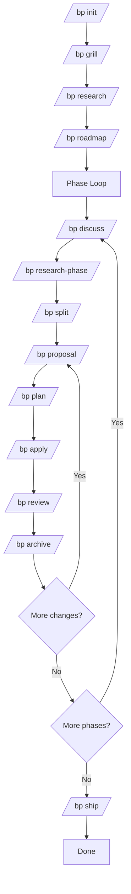

# Blueprint

**Spec-driven development workflow for AI coding agents.**

Write behavioral specs once, let agents implement against them across the full project lifecycle. Structured validation at every gate, PEG grammar-checked artifacts, auto-advancing state machine.

## Why

AI coding agents are powerful but unpredictable — requirements exist only in chat history, context rots across long sessions, and there's no repeatable workflow. Blueprint solves this:

- **Spec alignment before code.** Requirements, design decisions, and behavioral contracts are captured as structured artifacts, not chat.
- **Fresh-context sub-agents.** Heavy work (research, planning, implementation, review) delegates to spawned sub-agents with clean context — no rot.
- **State machine CLI.** `bp continue` auto-advances through the workflow. The CLI is the single source of truth; agents orchestrate, not implement.
- **PEG-validated artifacts.** Every output document is checked against a formal grammar — format errors are caught before they propagate.
- **Delta-spec merge.** Change-level behavioral contracts merge into global specs on archive with SHA-256 fingerprinting.

## Core Concepts

```
Project → Milestone → Phase → Change
```

| Entity | Description |
|--------|-------------|
| **Milestone** | Release cycle ("M2-api", "M3-dashboard") |
| **Phase** | Work unit within a milestone ("ph.1-board-engine") |
| **Change** | Implementation unit — goes through plan→apply→review→archive |
| **Adhoc Change** | Independent change outside a milestone/phase |

Workflow is a **dual nested loop**:

```
Phase loop:  discuss → research-phase → split → [change loop] → ship
Change loop: proposal → plan → apply → review → archive
```

## Quick Start

```bash
npm install -g @hyperion2144/blueprint
mkdir my-project && cd my-project
bp init
```

```bash
# Auto-advance through every step
bp continue

# Advance a specific change
bp continue change <name>
```

## CLI Reference

| Command | Description |
|---------|-------------|
| `bp init` | Initialize project structure with interactive wizard (tech stack, profile, conventions) |
| `bp continue` | Auto-advance project to the next step |
| `bp continue change <name>` | Advance a specific change |
| `bp change new <name>` | Create a new adhoc change |
| `bp state` | View current state, step, pending work |
| `bp state set-milestone <id>` | Switch active milestone |
| `bp list` | List milestones, phases, changes, archive |
| `bp context <step>` | Output file manifest + state + specs for agent context injection |
| `bp template <type>` | Generate a file template (proposal, design, tasks, etc.) |
| `bp config [list\|set]` | View or modify project configuration |
| `bp archive <change>` | Archive a completed change — delta-merge specs + code backfill |
| `bp commit <msg>` | Commit with conventional format, record commit hash in tasks.md |
| `bp dispatch <role>` | Output platform-specific sub-agent dispatch instructions |
| `bp ship` | Create PR or Release from unpublished changes |
| `bp audit` | Generate human UAT verification document from change deliverables |
| `bp milestone archive <id>` | Archive completed milestone |
| `bp add-phase <name>` | Insert a new phase into the current milestone |
| `bp upgrade` | Regenerate all platform files to match latest templates |
| `bp update` | (alias for upgrade) |
| `bp:loop` | Autonomous loop — full unattended execution |

## Validation System

Every artifact is validated at **PEG grammar level** before the state machine allows advancement. 15 formal grammars cover the full document set:

| Document | PEG file | Validation dimensions |
|----------|----------|----------------------|
| **proposal.md** | `proposal.peggy` | PR IDs sequential, refs format (FR-/NFR-/D-), Source annotation |
| **design.md** | `design.peggy` | DS IDs sequential, refs format (PR-), refs: on separate indented line |
| **tasks.md** | `tasks.peggy` | T IDs sequential, type validation (behavior/config/refactor/docs/scaffolding), multi-line acceptance |
| **context.md** | `context.peggy` | D IDs sequential, decision status + reason |
| **requirements.md** | `requirements.peggy` | FR/NFR IDs sequential |
| **roadmap.md** | `roadmap.peggy` | Md/Ph IDs sequential, correct nesting |
| **spec-review.md** | `spec-review.peggy` | R IDs sequential |
| **quality-review.md** | `quality-review.peggy` | Q IDs sequential |
| **goal-review.md** | `goal-review.peggy` | G IDs sequential |
| **uat.md** | `uat.peggy` | UC IDs sequential |
| **verification.md** | `verification.peggy` | Structure verification |
| **review-task.md** | `review-task.peggy` | FT IDs sequential, type validation |
| 3 research docs | `research-summary.peggy` + `phase-research.peggy` + `change-summary.peggy` | Structural validation |

**Coverage chain**: `checkCoverage(PR → DS → T)` verifies every deliverable has a corresponding design item, every design has a corresponding task. Cross-phase integration is validated before apply.

**Exit gates**: Each step pre-validates before advancing. All checks produce specific error messages pinpointing the exact line and format violation.

## Templates

27 artifact templates, generated by `bp template <type>`:

| Category | Templates |
|----------|-----------|
| **Change** | proposal, design, tasks, verification, spec-review, quality-review, goal-review, uat |
| **Phase** | context, research, summary, phase-research, change-summary |
| **Project** | roadmap, requirements, spec, global-spec |
| **Research** | research-stack, research-architecture, research-pitfalls |
| **Codebase** | codebase-summary, codebase-actions, codebase-directory, codebase-structure, codebase-interfaces, codebase-dataflow, codebase-constants |
| **Design** | design-preview, review-design, review-tasks |
| **Other** | loop.md |

Platform files (agents, commands, hooks) are generated from TypeScript source:

```bash
bp update    # regenerates all platform files
```

## Workflow

### Project Loop

```
init → grill → research → roadmap → discuss → research-phase → split → [change loop] → ship
```

Each step advances via `bp continue`. The CLI tracks state in `bp/state.md`.

### Change Loop

```
proposal → plan → apply → review → archive
```

- **proposal**: Define PR items with refs to requirements (FR-N) and decisions (D-N)
- **plan**: Create design items (DS-N) with refs to PR items, then task items (T-N) with types
- **apply**: Wave-based execution with parallel sub-agents, TDD for behavior tasks
- **review**: Triple review — spec review + quality review + goal review
- **archive**: Delta-spec merge + code backfill + state cleanup

### Loop Diagram



## Configuration

`bp/project.yml`:

| Key | Description | Default |
|-----|-------------|---------|
| `profile` | Workflow strictness: `lite`, `standard`, `strict` | `standard` |
| `platform` | Target agent platform: `omp`, `claude-code`, `agent` | `omp` |
| `spec.stack` | Tech stack spec template | `generic` |
| `workflow.tdd` | Enforce RED→GREEN→REFACTOR for behavior tasks | `true` |
| `workflow.commitDocs` | Auto-commit doc changes with code | `false` |
| `review.gate` | Review gate mode: `all-pass`, `any-pass` | `all-pass` |
| `release.template` | PR body template: `standard`, `detailed` | `standard` |

### Profiles

| Profile | TDD | Sub-agents | Review gate |
|---------|-----|------------|-------------|
| **Lite** | Optional | Sequential | Any pass |
| **Standard** | Enforced | Parallel (3 agents) | All pass |
| **Strict** | Enforced | Parallel + regression check | All pass + manual UAT |

## Tech Stack

- Language: TypeScript (strict, ESM, ES2022)
- Runtime: Node.js ≥ 20
- Tests: Vitest (155+)
- Validation: PEG grammars via Peggy
- State persistence: Zod-validated Markdown with `flock` concurrency locking

## Install

```bash
npm install -g @hyperion2144/blueprint
```

Requires Node.js ≥ 20.

## Development

```bash
git clone https://github.com/hyperion2144/blueprint.git
cd blueprint
npm install
npm run build
npm test
```

```bash
# Quick CLI smoke test
node bin/cli.js state
```

## License

MIT
