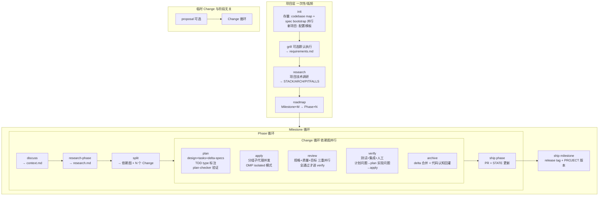

# Proposal: Bootstrap blueprint Core

## Intent

blueprint 是一个规格驱动开发工作流系统。本项目是 blueprint 的自举——用 blueprint 自身的流程来构建 blueprint CLI。此 change 定义 blueprint 的完整架构设计，作为后续所有实现工作的规格基础。

通过 grill-me 技能完成了 21 项核心决策的讨论，覆盖形态、实体层级、流程结构、产物 schema、CLI/命令架构、spec 机制、并行策略、TDD、review 门控、config、状态机、onboarding、ship、临时 change、continue、模型配置、子代理定义。

## Scope

### In scope

- 完整架构设计文档（21 项决策 + 流程图 + 产物 schema + agent 定义）
- 后续 research/roadmap/plan/apply 的规格基础

### Out of scope

- 具体技术选型（CLI 框架、解析器等 — 留给 research 阶段）
- 实现代码（留给 plan/apply 阶段）
- Claude Code 平台支持（Phase 2）

## Approach

### 参考项目

| 项目 | 许可证 | 借用方式 |
|---|---|---|
| OpenSpec | MIT | 架构模式（CLI 结构/命令生成/profile）+ 按需 vendoring 模块 |
| GSD Core | MIT | 概念（milestone/phase/fresh-context）+ 按需 vendoring 模块 |
| Trellis | AGPL-3.0 | **仅参考概念**，不拷代码（许可证传染性约束） |

### 1. 项目形态

独立 TypeScript CLI 包。agent 纯编排，每步回调 CLI。

```
用户: /blueprint:plan add-auth
  ↓ slash command 扩展为 prompt
prompt body:
  "读取 skill://blueprint-plan 获取设计工作流指引。
   运行 `blueprint context plan` 获取上下文清单（spec 注入）。
   按工作流执行，每步通过 bash 调用 blueprint CLI 管理产物。
   重活用 task 工具 fan-out 子代理。"
  ↓
模型: read skill → 执行工作流 → bash 调 CLI → task fan-out
```

### 2. 实体层级

```
Project → Milestone（恒存，默认 v1）→ Phase → Change
```

- **Milestone** = 版本周期（可发布增量），所有 phase ship 后发布
- **Phase** = 工作单元，走 discuss→research→split→change循环→ship
- **Change** = 变更单元，走 plan→apply→review→verify→archive

### 3. 双循环嵌套流程



### 4. 产物 Schema

```
blueprint/                                      ← 根目录（非隐藏）
├── project.yml                              配置 [platform/profile/context/workflow]
├── project.md                               项目概述
├── requirements.md                          需求规格 [grill 产出]
├── roadmap.md                               Milestone×M → Phase×N [roadmap 产出]
├── state.md                                 状态机（change 步骤级跟踪）
│
├── specs/                                   行为契约 = 真理源
│   └── <domain>/spec.md                     SHALL/MUST + GIVEN/WHEN/THEN
│                                            [delta-spec 合并 + update-spec 回灌 + 自动注入]
│
├── conventions/                             项目约定 [直接编辑 + 自动注入(只读)]
│   ├── coding.md
│   ├── architecture.md
│   └── review.md
│
├── research/                                项目级调研 [init 时 codebase mapping]
│   ├── summary.md
│   ├── stack.md
│   ├── architecture.md
│   ├── pitfalls.md
│   └── codebase/                            存量项目技术现状
│
├── milestones/<milestone-id>/               里程碑产物
│   ├── goal.md
│   └── phases/<phase-id>/
│       ├── context.md                       实现决策 [discuss 产出]
│       ├── research.md                      阶段调研
│       ├── changes/<change-name>/           ← phase 内 change（嵌套式）
│       │   ├── proposal.md                  为什么+什么
│       │   ├── design.md                    怎么做
│       │   ├── tasks.md                     实现清单+TDD协议(type标注)
│       │   ├── .blueprint.yaml                 change 元数据
│       │   └── specs/<domain>/spec.md       delta-specs
│       ├── reviews/                         三重 review 产物
│       │   ├── spec-review.md
│       │   ├── quality-review.md
│       │   └── goal-review.md
│       ├── verification.md                 验证报告
│       └── summary.md                       phase 汇总
│
├── changes/<change-name>/                   临时 change（与阶段无关）
│   └── (同 phase 内 change 结构)
│
├── archive/                                 统一归档
│   └── <date>-<change-name>/
│
└── workspace/
    └── journal.md                           跨会话记忆
```

### 5. Spec 分层

| 层 | 内容 | delta 机制 | update-spec 回灌 | 自动注入 |
|---|---|---|---|---|
| `specs/` | 行为契约（SHALL/MUST + GIVEN/WHEN/THEN） | ✓ plan 预写 delta，archive 合并 | ✓ 从代码 diff 提取行为回灌 | ✓ |
| `conventions/` | 项目约定（编码/架构/review 标准） | ✗ 直接编辑 | ✗ 提示人工更新 | ✓ 只读 |

### 6. Spec 双重回灌（archive 时）

1. **delta-spec 合并**（OpenSpec 机制）：plan 阶段预写的 `change/specs/<domain>/spec.md` 确定性合并到全局 `specs/`
2. **代码认知提取**（Trellis 机制）：子代理从代码 diff 提取新行为/约束，补充到 `specs/`。如果是约定变化，提示人工更新 `conventions/`

### 7. 三层架构

| 层 | OMP 机制 | 位置 | 角色 |
|---|---|---|---|
| CLI | 外部二进制，bash 调用 | `blueprint <cmd>` | 产物管理（init/state/archive/config/context） |
| Slash commands | prompt 模板 | `.omp/commands/*.md` | 工作流触发（扩展为 prompt） |
| Skills | 知识包 | `skills/<name>/SKILL.md` | 工作流指引（模型按需 read skill://） |
| 子代理 | task 工具，batch 并行 | `.omp/agents/*.md` | 重活 fan-out（research/apply/review） |

`blueprint update` 命令读取 `project.yml` 的 platform 配置，为每个平台生成对应的 slash command + skill + agent 文件。

### 8. CLI 命令

| 命令 | 作用 |
|---|---|
| `blueprint init` | 初始化 blueprint/ 目录结构 + 生成平台文件 |
| `blueprint update` | 重新生成平台命令文件 |
| `blueprint config [set]` | 查看/修改配置 |
| `blueprint state` | 查看当前状态 |
| `blueprint context <step>` | 输出步骤上下文清单（spec 注入） |
| `blueprint continue` | 状态机推进 + 输出下一步 |
| `blueprint archive <change>` | 归档（delta 合并 + 代码提取回灌） |
| `blueprint list` | 列出 milestones/phases/changes |
| `blueprint template <type>` | 生成模板文件 |

### 9. Slash 命令

| 命令 | 步骤 | 子代理 |
|---|---|---|
| `/blueprint:init` | 项目初始化 | ✓ codebase+spec 并行（存量） |
| `/blueprint:grill` | 需求探讨 | - |
| `/blueprint:research` | 项目调研 | ✓ 并行多方向 |
| `/blueprint:roadmap` | 路线图 | - |
| `/blueprint:discuss` | Phase 讨论 | - |
| `/blueprint:research-phase` | Phase 调研 | ✓ 并行 |
| `/blueprint:split` | Change 拆分 | - |
| `/blueprint:plan` | Change 设计 | ✓ 可并行 |
| `/blueprint:apply` | 实现 | ✓ 分组并发 |
| `/blueprint:review` | 审查 | ✓ 三重并行 |
| `/blueprint:verify` | 验证 | ✓ 可并行 |
| `/blueprint:archive` | 归档 | - |
| `/blueprint:ship` | 交付 | - |
| `/blueprint:continue` | 自动推进 | - |

### 10. 子代理 Agent 定义（6 个）

| Agent | 职责 | 工具集 | 模型角色 | thinkingLevel |
|---|---|---|---|---|
| blueprint-researcher | 技术调研 → STACK/ARCH/PITFALLS/RESEARCH | read,grep,glob,lsp,web_search,write,bash | research | high |
| blueprint-planner | Change 设计 → proposal/design/tasks/delta-specs | read,grep,glob,lsp,write,bash | plan | high |
| blueprint-executor | 代码实现 → TDD RED→GREEN→REFACTOR | read,edit,write,bash,grep,glob,lsp,ast_grep,ast_edit | execute | medium |
| blueprint-reviewer | 三重审查（batch×3 并行）→ review 报告 | read,grep,glob,lsp,ast_grep,bash | review | high |
| blueprint-verifier | 测试验证 → 诊断路由回环 | read,bash,grep,glob,lsp,edit,write | verify | medium |
| blueprint-archiver | 归档 → delta 合并 + 代码认知回灌 | read,grep,glob,write,bash,edit | archive | - |

执行模式：子代理直接写文件到 `blueprint/` 目录，通过 bash 调用 `blueprint` CLI 管理状态转换。`blueprint update` 根据 `project.yml` 的 `models` 配置生成 agent 定义文件。

三重 review 并行：一次 task 调用传 `tasks[3]` 数组，每个 task 传不同 assignment（"审查规格符合性"/"审查代码质量"/"审查目标达成"），batch 并发。

### 11. Config Schema

```yaml
# blueprint/project.yml
version: 1
platform: [omp]                    # 多平台，先 OMP 后 Claude Code
profile: standard                  # lite | standard | strict
context: |                         # 项目上下文注入（所有步骤）
  ...
workflow:                          # absent = enabled
  research: true
  plan_check: true
  tdd: true
  triple_review: true
  auto_advance: true
  spec_injection: true
review:
  gate: all-pass                   # all-pass | severity | report-only
  parallel: true
change:
  parallel: dependency-graph       # serial | dependency-graph | pipeline
  isolation: true
git:
  branching: none                  # none | phase | milestone
  create_tag: true
conventions:
  inject: true
models: {}                         # profile 自动填充，可按步骤角色覆盖
```

### 12. Profile 模型映射

模型角色引用 OMP `modelRoles`（slow/default/smol），不硬编码模型 ID。

| 角色 | lite | standard | strict |
|---|---|---|---|
| research | default | slow | slow:high |
| plan | default | slow | slow:high |
| execute | default | default | slow |
| review | default | slow | slow:high |
| verify | default | default | slow |
| archive | smol | default | default |

### 13. state.md 状态机

```yaml
---
project:
  status: <project-layer-status>
  current_milestone: <ms-id>
  current_phase: <phase-id>
active_context:
  type: milestone | phase | change | adhoc
  ref: <path>
  step: <step-name>
changes:                           # 依赖图并行：跟踪所有 change 状态
  - name: <change-name>
    status: planning | applying | reviewing | verifying | archiving | blocked
    depends_on: [<change-name>]
adhoc:                             # 活跃的临时 change
  - name: <change-name>
    status: <step-name>
---
```

状态机路径：
- 项目层: `initialized → requirements-defined → researched → roadmap-defined`
- Milestone: `milestone-active → milestone-shipped`
- Phase: `phase-discuss → phase-research → phase-split → phase-active → phase-shipped`
- Change: `change-proposal → change-planning → change-applying → change-reviewing → change-verifying → change-archived`
- 临时 Change: `adhoc-proposal → (同 Change 循环)`

### 14. continue 自动推进

`/blueprint:continue` 读 state.md → 状态机确定当前位置+下一步 → 自动触发对应 slash command。

### 15. TDD 强制

tasks.md 每个 task 标注 type：
- `type:behavior` → 强制 RED→GREEN→REFACTOR
- `type:config/refactor/docs/scaffolding` → 跳过 TDD

plan-checker 验证 tasks.md 分类正确。verify 检查 behavior 类 task 的 commit 历史。

### 16. Review 门控

三重 review（规格/质量/目标）batch tasks[3] 并行。全部通过才进 verify。可配置降级（`review.gate: severity` → critical 必须修，warning 可继续）。

### 17. Verify 回环

verify 失败 → 诊断根因 → 路由：
- 计划缺陷（设计错了/漏了）→ 回 plan 重设计
- 实现缺陷（代码错了）→ 回 apply 重实现
- 规格缺陷（spec 本身错了）→ 标记 spec 待修，回 plan 修 spec + 重实现

### 18. 存量 onboarding

init 时并行：codebase mapping（产出 `research/codebase/`，技术现状）+ spec bootstrap（提取行为契约到 `specs/`）。

### 19. 两级 ship

- **ship phase**: 创建 PR + 更新 state.md + 归档 phase 产物
- **ship milestone**: 创建 release PR/tag + 更新 project.md 版本 + 归档 milestone

### 20. 临时 Change

根级 `blueprint/changes/<name>/`，与阶段无关。可选 proposal 步骤，然后直接走 Change 循环。archive 统一到 `blueprint/archive/`。

### 21. 多平台

CLI 生成平台特定文件。`blueprint update` 检测 `project.yml` 的 platform 配置，为每个平台生成对应 slash commands + skills + agent 定义。先 OMP（`.omp/commands/` + `.omp/agents/` + `skills/`），后 Claude Code（`.claude/commands/` + `.claude/agents/`）。
