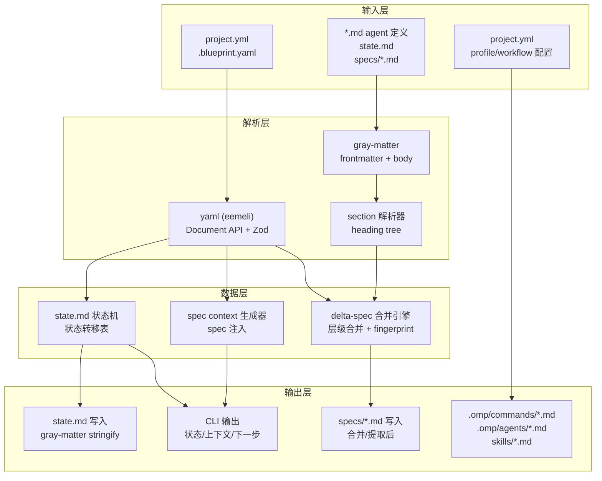
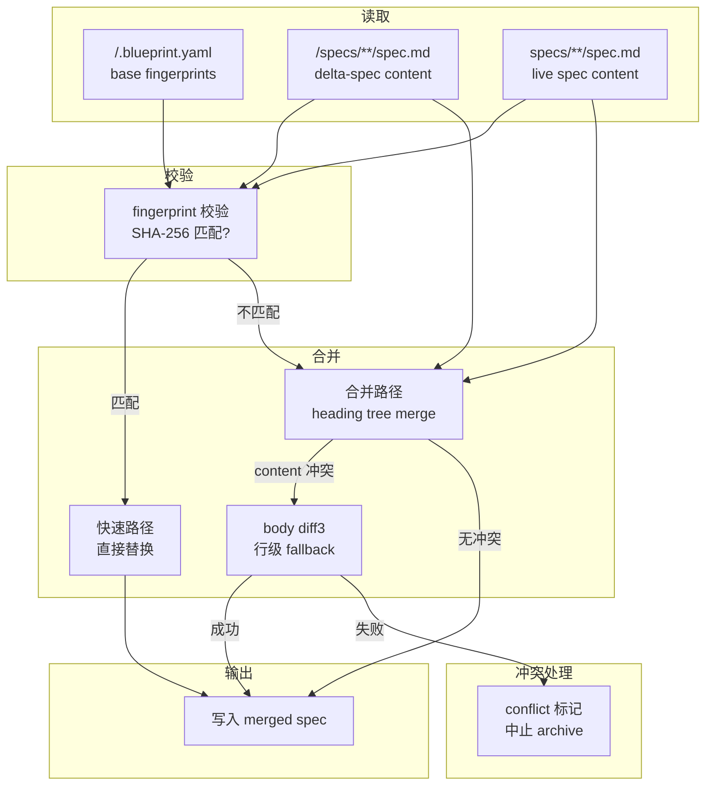
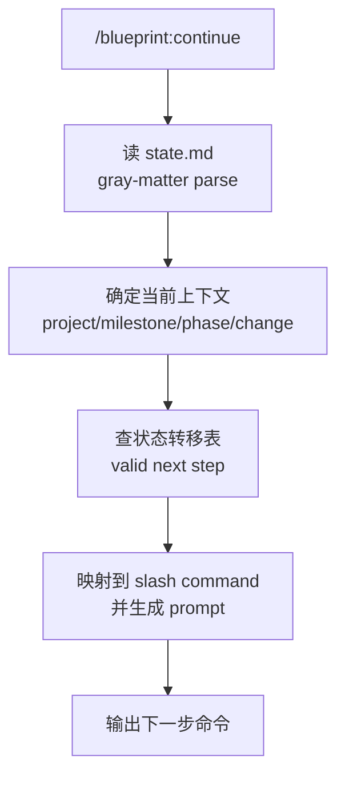

# 核心数据层架构调研报告

> 调研时间: 2026-06-29
> 调研范围: YAML/Markdown 解析、delta-spec 合并算法、state.md 状态机
> 状态: 初稿

---

## 目录

1. [YAML 解析方案](#1-yaml-解析方案)
2. [Markdown Frontmatter 解析方案](#2-markdown-frontmatter-解析方案)
3. [Delta-Spec 合并算法](#3-delta-spec-合并算法)
4. [state.md 状态机](#4-statemd-状态机)
5. [数据流图](#5-数据流图)
6. [推荐汇总](#6-推荐汇总)

---

## 1. YAML 解析方案

### 1.1 候选方案对比

| 维度 | js-yaml (4.x) | yaml (2.x, eemeli) | yaml + zod |
|------|---------------|---------------------|------------|
| **许可证** | MIT | ISC | ISC + MIT |
| **TypeScript** | 需 `@types/js-yaml` | 内置类型定义 | 内置 + Zod 推导 |
| **YAML 标准** | YAML 1.2 | YAML 1.1 + 1.2 | 取决于底层库 |
| **读性能** | ~500ms (快) | ~2000ms (中等) | 同 yaml + 验证开销 |
| **写性能** | ~7900ms (慢) | ~2400ms (快) | 同 yaml |
| **注释保留** | 不支持 | 支持（Document API） | 同 yaml |
| **AST 访问** | 无 | 完整 AST（Document/Node） | 同 yaml |
| **Schema 验证** | 无（手动校验） | 有限（内置 schema） | Zod 强类型 + runtime |
| **包体积** | 347KB | 420KB | + Zod ~30KB |
| **月下载** | ~80M | ~25M | Zod ~40M |

### 1.2 关键能力分析

#### 注释保留：yaml Document API

`yaml` 2.x 的 `Document` API 是 blueprint 必须的特性。`project.yml` 包含大量注释（配置说明、profile 说明等），修改配置写入时必须保留这些注释。

```typescript
import YAML from 'yaml';

// 读（保留注释）
const doc = YAML.parseDocument(yamlString);
// doc.contents 是 AST
doc.contents.commentBefore; // 保留注释
const config = doc.toJS();  // 纯对象

// 改
config.profile = 'strict';
doc.contents = YAML.createNode(config);

// 写（注释保留）
const output = String(doc); // 或 doc.toString()
```

`js-yaml` 在 v4 不支持注释保留，这是排除它的关键原因。

#### 类型安全：yaml + zod

YAML 配置需要 runtime 类型验证（文件可能被手动编辑出 bug），而 `yaml` 的 `toJS()` 返回 `any`。配合 Zod 可以同时获得：

```typescript
import { parse } from 'yaml';
import { z } from 'zod';

const ProjectConfigSchema = z.object({
  version: z.literal(1),
  platform: z.array(z.enum(['omp', 'claude-code'])),
  profile: z.enum(['lite', 'standard', 'strict']),
  context: z.string(),
  workflow: z.object({
    research: z.boolean().optional(),
    plan_check: z.boolean().optional(),
    tdd: z.boolean().optional(),
    triple_review: z.boolean().optional(),
    auto_advance: z.boolean().optional(),
    spec_injection: z.boolean().optional(),
  }),
  review: z.object({
    gate: z.enum(['all-pass', 'severity', 'report-only']).optional(),
    parallel: z.boolean().optional(),
  }),
  change: z.object({
    parallel: z.enum(['serial', 'dependency-graph', 'pipeline']).optional(),
    isolation: z.boolean().optional(),
  }),
});

type ProjectConfig = z.infer<typeof ProjectConfigSchema>;

export function loadProjectConfig(path: string): ProjectConfig {
  const raw = parse(readFileSync(path, 'utf-8'));
  return ProjectConfigSchema.parse(raw);
}
```

#### 使用场景细分

| 场景 | 推荐库 | 原因 |
|------|--------|------|
| `project.yml` 读 + 写（保留注释） | `yaml` + Document API | 注释保留 + 便捷修改 |
| `.blueprint.yaml` 读（change 元数据） | `yaml` + parse() + Zod | 类型安全，无需写回 |
| `blueprint config set` 写回 | `yaml` + Document API | 修改后写回保留注释 |
| agent 定义 YAML frontmatter | `gray-matter`（见下节） | 天然分离 frontmatter + body |
| 高性能批量解析 | `js-yaml`（需评估） | 目前无此场景 |

### 1.3 推荐方案

**使用 `yaml` (eemeli) 2.x + `zod` 组合。**

- 读配置/写配置用 `yaml` Document API 保留注释
- 类型验证用 Zod schema `parse()`
- 只需要读数据时用 `yaml` 的 `parse()` + Zod

```typescript
// 读取并验证
import { parse, parseDocument, stringify } from 'yaml';
import { z } from 'zod';

// 类型定义
const StateMachineSchema = z.object({
  project: z.object({
    name: z.string(),
    status: z.string(),
    current_milestone: z.string().nullable(),
    current_phase: z.string().nullable(),
  }),
  active_context: z.object({
    type: z.enum(['project', 'milestone', 'phase', 'change', 'adhoc']),
    ref: z.string().nullable(),
    step: z.string(),
  }),
  changes: z.array(z.object({
    name: z.string(),
    status: z.string(),
    depends_on: z.array(z.string()),
  })),
});

// 写入保留注释
export function writeYamlWithComments(path: string, data: unknown, templatePath?: string) {
  let doc;
  if (templatePath && existsSync(templatePath)) {
    doc = parseDocument(readFileSync(templatePath, 'utf-8'));
    doc.contents = createNode(data);
  } else {
    doc = new Document(data);
  }
  writeFileSync(path, String(doc), 'utf-8');
}
```

---

## 2. Markdown Frontmatter 解析方案

### 2.1 候选方案对比

| 维度 | gray-matter (4.x) | front-matter (4.x) | 自实现 |
|------|-------------------|---------------------|--------|
| **许可证** | MIT | MIT | - |
| **月下载** | ~16M | ~7M | - |
| **积极维护** | 是（5年未大更但稳定） | 否（6年前最后更新） | 需自维护 |
| **YAML 支持** | 默认 | 默认 | 自实现 |
| **JSON/TOML 支持** | 内建 | 无 | 自实现 |
| **自定义分隔符** | 支持 | 有限 | 自实现 |
| **stringify** | 内建 | 无 | 自实现 |
| **文件读取** | `read()` 原生 | 无 | 自实现 |
| **解析速度** | 快（C 无依赖） | 快 | 取决于实现 |
| **ESM 支持** | 需验证导入方式 | 无 | - |
| **错误处理** | 静默 fallback | 抛出 | 自实现 |

### 2.2 使用场景分析

blueprint 需要 frontmatter 解析的三个场景：

#### 场景 A：解析 agent 定义文件（`.omp/agents/*.md`）

这些文件是纯 Markdown，frontmatter 存放 agent 配置（type、tools、model 等），body 是 agent 系统提示。**只读场景**，不修改写回。

```yaml
---
type: agent
name: blueprint-planner
model: slow
thinking: high
tools:
  - read
  - write
  - bash
---
# 系统提示

你是一个 blueprint planner...
```

#### 场景 B：解析 `.blueprint.yaml`（change 元数据）

实际上 `.blueprint.yaml` 是纯 YAML 文件，**不是** frontmatter + body 格式。用 `yaml` 库直接解析。

#### 场景 C：生成带 frontmatter 的文件

`blueprint init` 和 `blueprint template` 需要**写**带 frontmatter 的文件。例如 `state.md`：

```markdown
---
project:
  name: blueprint
  status: initialized
---
# State

## 当前位置

项目层 — 尚未开始。
```

### 2.3 推荐方案

**使用 `gray-matter` 作为 frontmatter 解析库。**

理由：
1. **活跃度最高**：月下载 16M，static-site 生态广泛验证
2. **功能完备**：默认 YAML，支持 JSON/TOML，自定义分隔符，stringify
3. **ESM 兼容**：4.x 版本支持 ESM（需用通配符或特定导入）
4. **stringify**：内置 `matter.stringify(body, data)`，直接生成 frontmatter Markdown
5. **错误处理**：解析失败时 frontmatter 为空，content 为全文，不会崩溃

```typescript
import matter from 'gray-matter';

// 解析
const parsed = matter(agentFileContent);
// parsed.data: { type: 'agent', name: 'blueprint-planner', ... }
// parsed.content: Markdown body（系统提示）
// parsed.orig: 原始字符串

// 生成
const output = matter.stringify(body, {
  project: { name: 'blueprint', status: 'initialized' },
  active_context: { type: 'project', ref: null, step: 'init' },
});

// 自定义分隔符（如需）
const parsed2 = matter(content, {
  delimiters: '~~~',  // 或 ['---', '---']
});
```

### 2.4 fallback：自实现方案（备选）

如果 `gray-matter` 的 ESM 导入出现问题（已知某些打包环境有 CJS/ESM 冲突），自实现一个简洁版本：

```typescript
/** 极简 frontmatter 解析器 */
function parseFrontmatter(text: string): { data: Record<string, unknown>; content: string } {
  const match = text.match(/^---\n([\s\S]*?)\n---\n?/);
  if (!match) return { data: {}, content: text };

  const yamlStr = match[1];
  // 尝试解析 YAML，失败时静默返回空 data
  try {
    const data = parse(yamlStr);
    return { data, content: text.slice(match[0].length) };
  } catch {
    return { data: {}, content: text };
  }
}

/** 极简 frontmatter 生成器 */
function stringifyFrontmatter(body: string, data: Record<string, unknown>): string {
  return `---\n${stringify(data)}---\n\n${body}`;
}
```

**不推荐优先使用自实现**——frontmatter 的 edge case（如空 frontmatter、纯 `---` 分隔符、YAML 错误嵌套）很多，gray-matter 已经全部处理好了。

---

## 3. Delta-Spec 合并算法

### 3.1 OpenSpec 现状与问题

#### OpenSpec 的当前合并机制

OpenSpec 的 archive 采用 **replace-only 语义**：

1. 每个 change 目录下有一份 delta-spec，描述修改的内容
2. archive 时，`buildUpdatedSpec()` 将主 spec 中对应的 requirement block **整个替换**为 delta 内容
3. 不做 base version 追踪，不做场景级合并

#### 已知问题

> 参考: [OpenSpec Parallel Delta Remediation Plan](https://github.com/Fission-AI/OpenSpec/blob/main/openspec-parallel-merge-plan.md)

- **第二个存档覆盖第一个**：两个并行 change 修改同一个 requirement 时，后 archive 的 change 整个替换 requirement block，前一个的修改（如新场景）丢失
- **无冲突检测**：没有 base fingerprint，无法判断 change 的起始点是否已过期
- **单粒度**：delta 语言只理解 requirement 级别，无法做 scenario 级合并

OpenSpec 的官方 remediation plan 分三阶段：
1. **Phase 0**：加 base fingerprint（SHA-256）+ archive 时校验哈希，不匹配则阻止 archive
2. **Phase 1**：加 `sync` 命令，用 diff3 做 per-requirement 3-way merge
3. **Phase 2**：扩展 delta 语言到 scenario 级，用 stable identifier 做细粒度合并

### 3.2 blueprint 的合并算法设计

blueprint 需要更强的合并机制，原因是：
- **嵌套结构**：spec 是 `## Purpose / ### Requirement / #### Scenario` 的四级层级结构
- **并发 change**：依赖图允许并行 change，archive 顺序可能不同于创建顺序
- **确定性回灌**：双重回灌（delta 合并 + 代码认知提取）需要非破坏性的合并

#### 算法核心思路：层级感知的 Three-Way Merge

```
输入:
  Base  (B): archive 时 live specs/ 中的当前片段
  Delta (D): change/specs/ 中的修改内容
  Fingerprint (F): change 创建时 spec 片段的 SHA-256

输出:
  Merged (M): 合并后的 spec 片段
  或 Conflict: 冲突列表
```

```

function mergeDeltaSpec(baseSpec: string, deltaSpec: string, baseFingerprint: string): MergeResult {
  // 1. 计算 base 的当前指纹
  const liveFingerprint = sha256(baseSpec);

  // 2. 指纹匹配 → Live spec 未变 → 直接替换
  if (liveFingerprint === baseFingerprint) {
    return { type: 'ok', merged: deltaSpec };
  }

  // 3. 指纹不匹配 → Live spec 被其他 change 修改过 → 需要 section 级合并

  // 3a. 解析两边的 section 树
  const baseSections  = parseHeadingTree(baseSpec);   // live spec
  const deltaSections = parseHeadingTree(deltaSpec);  // change delta

  // 3b. 按 section 标题匹配，递归合并
  const mergedSections = mergeSectionTrees(baseSections, deltaSections);

  // 3c. 格式化为 Markdown 输出
  return mergeSectionsToMarkdown(mergedSections);
}
```

#### 核心数据结构：Heading Tree

```typescript
interface HeadingNode {
  level: number;       // 1-6 (## → 2, ### → 3, #### → 4)
  title: string;       // section 标题文本（不含 #）
  content: string;     // heading 和下一级 heading 之间的 body 文本
  children: HeadingNode[];  // 子 sections
}

// Types of changes
type SectionChange =
  | { type: 'unchanged'; node: HeadingNode }      // 无改动
  | { type: 'added'; node: HeadingNode }           // 新增
  | { type: 'removed'; title: string }             // 删除
  | { type: 'modified'; base: HeadingNode; delta: HeadingNode; subChanges: SectionChange[] }  // 修改（含递归子变更）
  | { type: 'conflict'; base: HeadingNode; delta: HeadingNode; message: string }; // 冲突
```

#### 合并策略：按层级匹配与合并

```

function mergeSectionTrees(base: HeadingNode[], delta: HeadingNode[]): SectionChange[] {
  const result: SectionChange[] = [];

  // 索引：以 title + level 为 key
  const baseIndex  = new Map(base.map(s => [`${s.level}:${s.title}`, s]));
  const deltaIndex = new Map(delta.map(s => [`${s.level}:${s.title}`, s]));
  const allKeys = new Set([...baseIndex.keys(), ...deltaIndex.keys()]);

  for (const key of allKeys) {
    const b = baseIndex.get(key);
    const d = deltaIndex.get(key);

    if (b && !d) {
      // 在 base 中存在但在 delta 中不 → 未变更
      result.push({ type: 'unchanged', node: b });
    } else if (!b && d) {
      // 在 delta 中是新增
      result.push({ type: 'added', node: d });
    } else if (b && d) {
      // 两边都存在 → 比较 content + 递归合并 children
      if (b.content === d.content) {
        // content 相同，只看子 section 变更
        const subChanges = mergeSectionTrees(b.children, d.children);
        const hasChanges = subChanges.some(c => c.type !== 'unchanged');
        if (hasChanges) {
          result.push({ type: 'modified', base: b, delta: d, subChanges });
        } else {
          result.push({ type: 'unchanged', node: b });
        }
      } else {
        // content 不同 → body-level conflict
        // fallback: 尝试行级 diff3 合并
        const bodyMerge = tryLineMerge(b.content, d.content);
        if (bodyMerge) {
          // 成功合并
          const merged: HeadingNode = {
            ...b,
            content: bodyMerge,
            children: mergeSectionTrees(b.children, d.children)
              .filter(c => c.type === 'unchanged' || c.type === 'modified')
              .map(c => c.type === 'unchanged' ? c.node : /* 略 */),
          };
          result.push({ type: 'modified', base: b, delta: d, subChanges: [] });
        } else {
          // 无法自动合并 → conflict
          result.push({ type: 'conflict', base: b, delta: d, message: `Content conflict in section: ${b.title}` });
        }
      }
    }
  }

  return result;
}
```

#### 行级 diff3 合并（content 冲突时的 fallback）

```

function tryLineMerge(baseText: string, deltaText: string): string | null {
  // 简单逐行对比：如果 delta 的行全部存在于 base 中（或反之），认为是追加而非覆盖
  const baseLines  = new Set(baseText.split('\n'));
  const deltaLines = new Set(deltaText.split('\n'));

  const addedToDelta = [...deltaLines].filter(l => l.trim() && !baseLines.has(l));
  const removedFromBase = [...baseLines].filter(l => l.trim() && !deltaLines.has(l));

  if (removedFromBase.length === 0) {
    // 没有删除 → 只是追加 → 合并保留两边的行
    // 去重合并，保留顺序：base 的内容 + delta 新增内容
    const merged = mergePreservingOrder(baseText, deltaText);
    return merged;
  }

  // 两边都改了 → 需要人工解决
  return null;
}

function mergePreservingOrder(base: string, delta: string): string {
  const baseLines = base.split('\n');
  const deltaLines = delta.split('\n');

  // 检测 delta 相对于 base 的插入点
  // 以 base 为主，插入 delta 中不在 base 内的行
  const result: string[] = [];
  const deltaOnlyLines = deltaLines.filter(l => !baseLines.includes(l));

  for (const line of baseLines) {
    result.push(line);
  }

  // 追加 delta 独有的行（通常在末尾）
  for (const line of deltaOnlyLines) {
    if (!result.includes(line)) {
      result.push(line);
    }
  }

  return result.join('\n');
}
```

### 3.3 冲突处理策略

| 冲突类型 | 检测方式 | 处理方式 |
|----------|---------|---------|
| Section 新增 vs 新增 | Title + Level 去重 | 检测到同名 section，自动追加编号后缀或并列（按 KEEPBOTH） |
| Section 内容修改 vs 修改 | Body text diff3 | 优先自动 line-level merge；失败则标记 conflict |
| Section 删除 vs 修改 | delta 中未出现 | 视为 `unchanged`（base 中有的 section 不参与自动删除） |
| 子 section 冲突 | 递归合并子树 | 在父 section 中标记 conflict scope |

### 3.4 Base Fingerprint 持久化

每个 change 在创建时保存其 base 的 spec 哈希：

```typescript
// .blueprint.yaml 或 changes/<name>/meta.json
interface ChangeMeta {
  id: string;
  baseFingerprints: Record<string, string>;  // 路径 → SHA-256 of the requirement content at fork time
  createdAt: string;
}

// 创建 change 时记录
function captureBaseFingerprints(specPaths: string[]): Record<string, string> {
  const fingerprints: Record<string, string> = {};
  for (const path of specPaths) {
    const content = readFileSync(path, 'utf-8');
    fingerprints[path] = createHash('sha256').update(content).digest('hex');
  }
  return fingerprints;
}

// archive 时校验
function verifyFingerprints(meta: ChangeMeta): string[] {
  const stale: string[] = [];
  for (const [path, savedHash] of Object.entries(meta.baseFingerprints)) {
    if (!existsSync(path)) continue;
    const liveHash = createHash('sha256').update(readFileSync(path, 'utf-8')).digest('hex');
    if (liveHash !== savedHash) {
      stale.push(path);
    }
  }
  return stale;  // 返回指纹不匹配的文件列表
}
```

### 3.5 伪代码：完整 archive 流程

```

function archiveChange(changeId: string): ArchiveResult {
  const changeDir = findChangeDir(changeId);
  const meta = readChangeMeta(changeDir);
  const deltaRoot = path.join(changeDir, 'specs');

  // 1. 找所有 delta-spec 文件
  const deltaFiles = glob.sync('**/spec.md', { cwd: deltaRoot });

  for (const file of deltaFiles) {
    const liveSpecPath = path.join('specs', file);
    const deltaSpecPath = path.join(deltaRoot, file);

    // 2. 读取 delta 和 live spec
    const liveSpec = readFileSafe(liveSpecPath);
    const deltaSpec = readFileSafe(deltaSpecPath);

    if (!liveSpec) {
      // delta 新增的 spec 文件 → 直接创建
      writeFileSync(liveSpecPath, deltaSpec);
      continue;
    }

    // 3. 检查 fingerprint
    const savedHash = meta.baseFingerprints[file];
    const liveHash = sha256(liveSpec);

    if (savedHash && liveHash === savedHash) {
      // 3a. 指纹匹配 → 快速路径：直接替换
      writeFileSync(liveSpecPath, deltaSpec);
      continue;
    }

    // 3b. 指纹不匹配 → 合并路径
    const mergeResult = mergeDeltaSpec(liveSpec, deltaSpec, file);

    if (mergeResult.type === 'conflict') {
      // 冲突 → 写 conflict markers，阻止 archive
      writeConflictMarkers(liveSpecPath, mergeResult);
      return { status: 'conflict', file, details: mergeResult.conflicts };
    }

    // 写入合并结果
    writeFileSync(liveSpecPath, mergeResult.merged);
  }

  // 4. 写入代码认知提取（Trellis 机制）
  const codeExtractions = await extractBehaviorsFromDiff(changeDir);
  for (const extraction of codeExtractions) {
    const specPath = path.join('specs', extraction.path);
    integrateCodeExtraction(specPath, extraction.content);
  }

  return { status: 'archived' };
}
```

### 3.6 关键设计决策

1. **Section 级合并，不试图做文本级合并**：spec 是层级结构（`## Purpose > ### Requirement > #### Scenario`），按 heading 匹配更可靠。文本级 diff 只作为 body 冲突时的 fallback。

2. **新增 section 不删除**：如果 base 中有 section 但 delta 中没有（即 delta 未提及某 section），视为 unchanged。只有 `REMOVED` 显式标记的才删除。这避免了"delta 没写某 section 就被自动删掉"的问题。

3. **Fingerprint 校验阻止无声覆盖**：继承 OpenSpec Phase 0 的教训——没有 fingerprint 校验就阻止 archive，永远不允许无声覆盖。

4. **双重回灌**：先做 delta 合并（确定性），再做代码认知提取（AI 辅助）。后者的输出需要人工确认（标记 `AUTO-EXTRACTED`），不自动覆盖。

---

## 4. state.md 状态机

### 4.1 状态定义

```

/**
 * 顶层状态路径：
 *
 * 项目层:     initialized → requirements-defined → researched → roadmap-defined
 * Milestone:  milestone-active → milestone-shipped
 * Phase:      phase-discuss → phase-research → phase-split → phase-active → phase-shipped
 * Change:     change-proposal → change-planning → change-applying → change-reviewing → change-verifying → change-archived
 * Adhoc:      adhoc-proposal → (同 Change)
 */

type ProjectStatus =
  | 'initialized'
  | 'requirements-defined'
  | 'researched'
  | 'roadmap-defined';

type MilestoneStatus =
  | 'milestone-active'
  | 'milestone-shipped';

type PhaseStatus =
  | 'phase-discuss'
  | 'phase-research'
  | 'phase-split'
  | 'phase-active'
  | 'phase-shipped';

type ChangeStatus =
  | 'change-proposal'
  | 'change-planning'
  | 'change-applying'
  | 'change-reviewing'
  | 'change-verifying'
  | 'change-archived'
  | 'blocked';  // 阻塞状态（可退出）

type AdhocStatus = ChangeStatus;

type ContextType = 'project' | 'milestone' | 'phase' | 'change' | 'adhoc';

type ActiveStep =
  // 项目层
  | 'init' | 'grill' | 'research' | 'roadmap'
  // 阶段层
  | 'discuss' | 'research-phase' | 'split'
  // Change 层
  | 'proposal' | 'plan' | 'apply' | 'review' | 'verify' | 'archive'
  // 交付层
  | 'ship' | 'continue';
```

### 4.2 状态转移表

| 上下文 | 当前状态 | 触发命令 | 目标状态 | 输出物 |
|--------|---------|---------|---------|--------|
| project | - | `init` | `initialized` | blueprint/ 目录结构、project.yml |
| project | `initialized` | `grill` | `requirements-defined` | requirements.md |
| project | `requirements-defined` | `research` | `researched` | research/summary.md, research/stack.md |
| project | `researched` | `roadmap` | `roadmap-defined` | roadmap.md |
| project | `roadmap-defined` | `discuss` | `phase-discuss`（第一个 phase） | milestone/<ms>/phases/<ph>/context.md |
| milestone | `milestone-active` | `ship` | `milestone-shipped` | Tag + project.md 版本 |
| phase | `phase-discuss` | `research-phase` | `phase-research` | research.md |
| phase | `phase-research` | `split` | `phase-split` | 依赖图 + N 个 change 目录 |
| phase | `phase-split` | `plan`（首个 change） | `phase-active` | design.md + tasks.md + delta-specs |
| phase | `phase-active` | 所有 change archived + `ship` | `phase-shipped` | PR + STATE 更新 |
| change | `change-proposal` | `plan` | `change-planning` | design.md + tasks.md + delta-specs |
| change | `change-planning` | `apply` | `change-applying` | 代码实现 |
| change | `change-applying` | `review` | `change-reviewing` | 三重 review |
| change | `change-reviewing` | `verify` | `change-verifying` | verification.md |
| change | `change-verifying` | `archive` | `change-archived` | delta 合并 + 代码回灌 |
| change | `any` | `block` | `blocked` | - |
| change | `blocked` | `unblock` | 原状态 | - |
| adhoc | `adhoc-proposal` | `plan` | `change-planning` | （同 change 循环） |

### 4.3 状态恢复逻辑（continue 命令）

`/blueprint:continue` 的状态机推进逻辑：

```

function determineNextStep(state: StateFile): string | null {
  const ctx = state.active_context;

  switch (ctx.type) {
    case 'project': {
      const transitions: Record<string, string> = {
        'initialized':         'grill',
        'requirements-defined':'research',
        'researched':          'roadmap',
        'roadmap-defined':     'discuss',   // 进入第一个 phase
      };
      return transitions[state.project.status] ?? null;
    }

    case 'milestone': {
      // 检查所有 phase 是否 shipped
      const allPhasesShipped = checkAllPhasesShipped(state.project.current_milestone);
      if (allPhasesShipped && state.project.status === 'roadmap-defined') {
        return 'ship';
      }
      return null;  // 等待 phase 完成
    }

    case 'phase': {
      const stepOrder = ['discuss', 'research-phase', 'split'];
      const currentIndex = stepOrder.indexOf(ctx.step);
      if (currentIndex < stepOrder.length - 1) {
        return stepOrder[currentIndex + 1];
      }
      // split 之后 → 找第一个待计划的 change
      return 'plan';  // 进入 plan 步骤
    }

    case 'change': {
      const stepOrder = ['proposal', 'plan', 'apply', 'review', 'verify', 'archive', 'ship'];
      const currentIndex = stepOrder.indexOf(ctx.step);
      if (currentIndex < stepOrder.length - 1) {
        return stepOrder[currentIndex + 1];
      }
      return null;  // change 完成
    }

    default:
      return null;
  }
}
```

### 4.4 state.md 实现

```yaml
# state.md 的 YAML frontmatter + Markdown body
---
project:
  name: blueprint
  status: researched                 # 项目层状态
  current_milestone: v1              # 可选，当前 milestone
  current_phase: bootstrap-core       # 可选，当前 phase
active_context:
  type: change                      # project | milestone | phase | change | adhoc
  ref: milestones/v1/phases/bootstrap-core/changes/add-cli
  step: plan                        # 当前执行步骤
changes:                            # 依赖图并行跟踪
  - name: add-cli
    status: change-planning
    depends_on: []
  - name: add-parser
    status: change-proposal
    depends_on: [add-cli]
adhoc:                              # 活跃的临时 change
  - name: fix-critical-bug
    status: change-applying
---
```

解析逻辑：

```typescript
import matter from 'gray-matter';
import { z } from 'zod';

// Zod schema for state.md frontmatter
const StateSchema = z.object({
  project: z.object({
    name: z.string(),
    status: z.string(),
    current_milestone: z.string().nullable(),
    current_phase: z.string().nullable(),
  }),
  active_context: z.object({
    type: z.enum(['project', 'milestone', 'phase', 'change', 'adhoc']),
    ref: z.string().nullable(),
    step: z.string(),
  }),
  changes: z.array(z.object({
    name: z.string(),
    status: z.string(),
    depends_on: z.array(z.string()).optional().default([]),
  })).optional().default([]),
  adhoc: z.array(z.object({
    name: z.string(),
    status: z.string(),
  })).optional().default([]),
});

export type State = z.infer<typeof StateSchema>;

// 解析 state.md
export function parseState(filePath: string): State {
  const content = readFileSync(filePath, 'utf-8');
  const parsed = matter(content);
  return StateSchema.parse(parsed.data);
}

// 生成/更新 state.md
export function writeState(filePath: string, state: State): void {
  const body = generateStateBody(state);  // 从 state 生成 Markdown body
  const output = matter.stringify(body, state.data);
  writeFileSync(filePath, output, 'utf-8');
}
```

### 4.5 状态机验证

```

function validateTransition(from: State, to: string): boolean {
  const validTransitions: Record<string, string[]> = {
    'initialized':          ['requirements-defined'],
    'requirements-defined': ['researched'],
    'researched':           ['roadmap-defined'],
    'roadmap-defined':      ['phase-discuss', 'milestone-active'],
    'milestone-active':     ['milestone-shipped'],
    'phase-discuss':        ['phase-research'],
    'phase-research':       ['phase-split'],
    'phase-split':          ['phase-active'],
    'phase-active':         ['phase-shipped'],
    'change-proposal':      ['change-planning'],
    'change-planning':      ['change-applying'],
    'change-applying':      ['change-reviewing'],
    'change-reviewing':     ['change-verifying'],
    'change-verifying':     ['change-archived'],
  };

  // 确定当前上下文的状态字段
  const ctx = from.active_context;
  let currentStatus: string;

  switch (ctx.type) {
    case 'project':  currentStatus = from.project.status; break;
    case 'change':   currentStatus = findChangeStatus(from, ctx.ref); break;
    case 'adhoc':    currentStatus = findAdhocStatus(from, ctx.ref); break;
    default:         currentStatus = ctx.step; break; // milestone/phase 用 step
  }

  const allowed = validTransitions[currentStatus] ?? [];
  return allowed.includes(to);
}
```

---

## 5. 数据流图

### 5.1 整体数据流



### 5.2 archive 操作内部数据流



### 5.3 continue 命令数据流



### 5.4 解析管线代码架构

```
src/
  parser/
    yaml.ts               # 封装 yaml Document API + Zod 验证
    frontmatter.ts        # 封装 gray-matter（解析 + 生成）
    heading-tree.ts       # Markdown heading tree 解析器
    spec-parser.ts        # spec 特定解析（## Purpose / ### Requirement / #### Scenario）
  state/
    machine.ts            # 状态机定义（状态 + 转移表 + 验证函数）
    state-file.ts         # state.md 读写（内部使用 matter + Zod）
    continue.ts           # continue 命令逻辑（确定下一步 + 生成命令）
  merge/
    delta-merge.ts        # delta-spec 合并引擎
    fingerprint.ts        # base fingerprint 计算与校验
    line-merge.ts         # 行级 diff3 合并
    conflict.ts           # 冲突检测与标记
```

---

## 6. 推荐汇总

### 技术选型推荐

| 组件 | 推荐方案 | 备选 | 关键理由 |
|------|---------|------|---------|
| YAML 解析 | `yaml` (eemeli) 2.x | `js-yaml` 4.x | 注释保留、Document API、内置 TS 类型 |
| 类型验证 | `zod` 3.x/4.x | 无 | — |
| Frontmatter 解析 | `gray-matter` 4.x | 自实现简洁版 | 生态成熟、stringify、通用性 |
| 状态机 | 自实现（纯函数 + 转移表） | `@edium/fsm` | 逻辑简单无依赖 |
| 合并算法 | 自实现 heading tree merge | 无 | spec 独特结构，无法套用通用库 |

### 关键架构决策

1. **yaml + zod 组合**：yaml 做解析/序列化（注释保留），zod 做类型校验。不解耦。

2. **gray-matter 直用**：不二次封装。所有 agent 定义文件的 frontmatter 解析统一使用 gray-matter，减少学习成本。

3. **Section 生命期管理**：specs/ 的修改路径只有两种——delta-spec 合并（plan→archive）和代码认知回灌（archive 时），不存在"直接编辑 specs/ 然后在 archive 时冲突"的场景。因此 fingerprint 只用于防冲突，不做版本管理。

4. **状态机轻量化**：不引入状态机库，纯数据驱动。状态和转移表定义为 `const` 对象，转移验证为纯函数。

5. **`yaml` Document API 只用于写保留注释的文件**：`project.yml` 和 `state.md` 需要写回保留注释；`.blueprint.yaml` 只读不需要。

