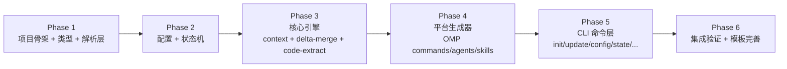

# Roadmap

## Milestone m1-core — CLI 核心可用 [COMPLETED]

**目标**: blueprint CLI 可初始化项目、管理状态、生成平台文件、推进流程。完成后用户能在真实项目中使用 blueprint 的完整工作流。

**验收标准**:
- `blueprint init` 能初始化项目目录结构
- `blueprint update` 能生成 OMP 平台文件（commands + agents + skills）
- `blueprint state` / `blueprint continue` 能读取状态并推进
- `blueprint context <step>` 能输出上下文清单
- `blueprint archive <change>` 能执行 delta-spec 合并 + 代码认知回灌
- `blueprint config` / `blueprint list` / `blueprint template` 辅助命令可用
- 全部通过 vitest 测试

---

## Phase 拆分

按依赖链自底向上拆分。每个 phase 产出一组可独立验证的模块。

---

### Phase 1: 项目骨架 + 类型定义 + 解析层

**目标**: 项目可编译，类型定义完整，YAML/frontmatter/heading-tree 解析可用。

**依赖**: 无（最底层）

**范围**:
- npm 项目初始化（package.json、tsconfig.json、tsup.config.ts、vitest.config.ts）
- `src/types/` — 所有 TypeScript 类型定义（project / state / spec / config）
- `src/parser/yaml.ts` — yaml(eemeli) Document API 封装 + zod 验证
- `src/parser/frontmatter.ts` — gray-matter 封装（解析 + 生成）
- `src/parser/heading-tree.ts` — Markdown heading tree 解析器
- `src/parser/spec-parser.ts` — spec 结构化解析（## Purpose / ### Requirement / #### Scenario）
- `bin/blueprint.js` — 入口 shebang（空 commander，仅 `--version`）

**验收**:
- `npm run build` 成功输出 ESM + dts
- `npx blueprint --version` 打印版本号
- 解析层单元测试通过（yaml 读写 + frontmatter 解析 + heading tree 构建 + spec 解析）

**Change 拆分预估**:
- `scaffold-project` — npm 项目骨架 + 构建配置
- `define-types` — TypeScript 类型定义
- `implement-parsers` — 4 个解析器

---

### Phase 2: 配置管理 + 状态机

**目标**: project.yml 读写 + state.md 读写 + 状态机引擎可用。

**依赖**: Phase 1（类型 + 解析层）

**范围**:
- `src/core/config.ts` — project.yml 读写（yaml Document API 保留注释）+ zod schema 校验
- `src/core/state-file.ts` — state.md 读写（gray-matter parse + stringify）
- `src/core/state-machine.ts` — 状态机定义（状态枚举 + 转移表 + 验证函数）
- `src/core/continue.ts` — continue 逻辑（读 state → 查转移表 → 确定下一步 → 映射 slash command）

**验收**:
- 能读写 project.yml 并保留注释
- 能读写 state.md frontmatter + body
- 状态机转移验证：合法转移通过，非法转移报错
- continue 逻辑：给定 state.md，输出正确的下一步命令

**Change 拆分预估**:
- `implement-config` — project.yml 读写
- `implement-state` — state.md 读写 + 状态机 + continue 逻辑

---

### Phase 3: 核心引擎

**目标**: context 注入 + delta-spec 合并 + 代码认知提取三大引擎可用。

**依赖**: Phase 2（config + state）

**范围**:
- `src/core/spec-injector.ts` — context 命令核心（读 state.md 确定作用域 → 按步骤类型确定注入范围 → 输出文件路径 + 行范围）
- `src/core/delta-merge.ts` — delta-spec 合并引擎（heading tree 三向合并 + SHA-256 fingerprint 冲突检测）
- `src/core/fingerprint.ts` — base fingerprint 计算与校验
- `src/core/code-extract.ts` — 代码认知提取（从 git diff 提取行为/约束 → 回灌 specs/）
- `src/core/file-tree.ts` — 产物目录树操作（blueprint/ 骨架创建/遍历）

**验收**:
- `specInjector.run(step, state)` 输出正确的文件清单
- delta-merge：给定 base + delta，正确合并；冲突时标记 CONFLICT
- code-extract：给定 git diff，提取行为变化
- file-tree：能创建完整的 blueprint/ 目录骨架

**Change 拆分预估**:
- `implement-spec-injector` — context 注入引擎
- `implement-delta-merge` — delta-spec 合并引擎
- `implement-code-extract` — 代码认知提取引擎

---

### Phase 4: 平台生成器

**目标**: `blueprint update` 能为 OMP 生成 slash commands + agent 定义 + skills。

**依赖**: Phase 2（config 读取 platform/profile/models）+ Phase 3（file-tree）

**范围**:
- `src/generators/omp-commands.ts` — 生成 `.omp/commands/blueprint-*.md`（14 个 slash command）
- `src/generators/omp-agents.ts` — 生成 `.omp/agents/blueprint-*.md`（6 个 agent 定义）
- `src/generators/skills.ts` — 生成 `skills/blueprint-*/SKILL.md`（14 个 skill）
- `src/generators/index.ts` — 生成器入口（读 project.yml → 调度各生成器 → 输出文件）
- 内置步骤定义表（14 个步骤的 frontmatter + prompt body 模板）
- 内置 agent 定义表（6 个角色的 frontmatter + systemPrompt 模板）

**验收**:
- `blueprint update` 在测试目录生成所有平台文件
- 生成的命令文件 frontmatter 格式正确
- agent 文件的 model 字段正确填充（从 project.yml models → profile 映射 → OMP 角色名）
- 重复运行 update 幂等（文件 hash 一致）
- 已修改的生成文件检测 + warning（pitfalls T18 缓解）

**Change 拆分预估**:
- `implement-command-generator` — OMP 命令生成
- `implement-agent-generator` — OMP agent 生成
- `implement-skill-generator` — skill 生成

---

### Phase 5: CLI 命令层

**目标**: 所有 CLI 子命令可用，用户能通过命令行完整操作 blueprint。

**依赖**: Phase 3（引擎）+ Phase 4（生成器）

**范围**:
- `src/commands/init.ts` — blueprint init（交互式向导 → 创建 blueprint/ 骨架 → 调 update 生成平台文件）
- `src/commands/update.ts` — blueprint update（调度生成器）
- `src/commands/config.ts` — blueprint config / config set（读写 project.yml）
- `src/commands/state.ts` — blueprint state（读 state.md → 格式化输出）
- `src/commands/context.ts` — blueprint context <step>（调 spec-injector → 输出文件清单）
- `src/commands/continue.ts` — blueprint continue（调 continue 逻辑 → 输出下一步命令）
- `src/commands/archive.ts` — blueprint archive <change>（调 delta-merge + code-extract → 归档）
- `src/commands/list.ts` — blueprint list（遍历 milestones/phases/changes）
- `src/commands/template.ts` — blueprint template <type>（生成模板文件）
- `src/prompts/init-wizard.ts` — init 交互向导（@clack/prompts）
- `src/cli.ts` — commander 主入口，注册所有子命令

**验收**:
- `blueprint init` 在空目录创建完整 blueprint/ 结构 + 平台文件
- `blueprint config set profile strict` 正确修改 project.yml
- `blueprint state` 输出当前状态
- `blueprint context plan` 输出 plan 步骤的上下文文件清单
- `blueprint continue` 输出下一步 slash command
- `blueprint archive <change>` 执行合并 + 回灌 + 移动到 archive/
- `blueprint list` 列出所有 milestone/phase/change
- `blueprint template proposal` 生成 proposal 模板

**Change 拆分预估**:
- `implement-init` — init 命令 + 交互向导
- `implement-update` — update 命令
- `implement-config-state` — config + state 命令
- `implement-context-continue` — context + continue 命令
- `implement-archive` — archive 命令
- `implement-list-template` — list + template 命令

---

### Phase 6: 集成验证 + 模板完善

**目标**: 端到端验证 blueprint 自身能用 blueprint 流程工作，模板完善。

**依赖**: Phase 5（所有命令可用）

**范围**:
- 集成测试：init → 创建 change → plan → archive 完整流程
- 模板文件完善（project.yml / state.md / proposal.md / .blueprint.yaml 模板）
- `blueprint init --brownfield` 存量项目模式（codebase mapping + spec bootstrap 调度）
- npm 发布配置（bin / engines / files / exports 最终确认）
- README.md 编写

**验收**:
- 集成测试：在临时目录 init → 创建测试 change → archive → 验证 specs/ 合并
- 模板渲染正确
- `npm pack` 打包正确
- README 可指引新用户完成 quickstart

**Change 拆分预估**:
- `integration-tests` — 端到端集成测试
- `finalize-templates` — 模板完善
- `brownfield-init` — 存量项目 init 模式
- `npm-publish-config` — 发布配置 + README

---

## 汇总

| Phase | 标题 | 依赖 | Change 数 | 预估关键产出 |
|---|---|---|---|---|
| 1 | 项目骨架 + 类型 + 解析层 | 无 | 3 | types/ + parser/ + 构建配置 |
| 2 | 配置 + 状态机 | 1 | 2 | config.ts + state-machine.ts |
| 3 | 核心引擎 | 2 | 3 | spec-injector + delta-merge + code-extract |
| 4 | 平台生成器 | 2,3 | 3 | omp-commands + omp-agents + skills 生成 |
| 5 | CLI 命令层 | 3,4 | 6 | 9 个子命令 + init 向导 |
| 6 | 集成验证 + 模板 | 5 | 4 | 集成测试 + 模板 + 发布配置 |

**总计**: 1 milestone × 6 phase × 21 change

## Milestone m2-claude-code — 多平台生成器 [CURRENT]

> Planning mode: technical-layer

**目标**: blueprint 支持三平台文件生成（OMP + Claude Code + `.agent/`），`blueprint update` 根据 project.yml 配置遍历生成。

**验收标准**:
- Provider interface 定义 + registry 注册机制，OMP 零改动注册为第一个 provider
- `src/integrations/claude-code/` 生成 `.claude/skills/` + `.claude/agents/`
- `src/integrations/agent/` 生成 `.agent/skills/`（`[BP:xxx]` 参数格式）+ `.agent/agents/`
- `.agent/skills/` 复用 WORKFLOW_REGISTRY 模板，参数从 `$1`/`$ARGUMENTS` 替换为 `[BP:xxx]`
- project.yml `platform: [...]` 数组支持多选，`blueprint update` 遍历生成
- 全部通过 vitest golden-file 测试
- 原有 OMP 生成完全不改变（路径、内容、格式）

---

### Phase 1: Provider Interface + Registry

**目标**: 定义 `PlatformProvider` 接口和 `PlatformRegistry`，将 `generators/index.ts` 改为 dispatch 模式。OMP 作为第一个 provider 注册，验证零行为变更。

**依赖**: 无（最底层，纯 refactor）

**范围**:
- `src/core/platform-registry.ts` — `PlatformProvider` 接口（`generateCommands()`, `generateAgents()`, `generateSkills()`）+ `PlatformRegistry`
- `src/core/platform-registry.test.ts` — provider 注册/注销/遍历测试
- 改造 `src/generators/index.ts` 为 dispatch 模式：遍历 `config.platform` → registry.resolve(platform) → provider.generate()
- `src/integrations/omp/index.ts` 注册为 `'omp'` provider
- `supportsCommands` 从模块级常量变为 per-provider capability flag

**验收**:
- 注册 OMP provider 后，`blueprint update` 输出与之前完全一致（golden-file 快照）
- platform-registry.test.ts 通过

**Change 拆分预估**:
- `define-provider-interface` — PlatformProvider + PlatformRegistry 类型和实现
- `refactor-generator-dispatch` — generator/index.ts 改为 dispatch 模式 + OMP 注册验证

---

### Phase 2: Claude Code Provider

**目标**: `src/integrations/claude-code/` 实现，生成 `.claude/skills/` + `.claude/agents/`。

**依赖**: Phase 1（provider interface）

**范围**:
- `src/integrations/claude-code/commands.ts` — 生成 `.claude/skills/bp-<step>/SKILL.md`（skill 格式，非 command）
- `src/integrations/claude-code/agents.ts` — 生成 `.claude/agents/bp-<role>.md`（Claude Code 格式 frontmatter）
- `src/integrations/claude-code/index.ts` — 注册为 `'claude-code'` provider
- WORKFLOW_REGISTRY 模板参数适配：`$1` → 保持 `$1`（Claude Code 原生参数格式）或 `[BP:xxx]`

**验收**:
- `platform: [claude-code]` 时 `blueprint update` 生成 `.claude/skills/` + `.claude/agents/`
- 文件格式符合 Claude Code 平台规范
- golden-file 测试

**Change 拆分预估**:
- `implement-claude-code-commands` — 命令/skill 生成
- `implement-claude-code-agents` — agent 生成

---

### Phase 3: .agent/ Provider

**目标**: `src/integrations/agent/` 实现，生成 `.agent/skills/`（`[BP:xxx]` 参数格式）+ `.agent/agents/`。

**依赖**: Phase 1（provider interface）

**范围**:
- `src/integrations/agent/skills.ts` — 生成 `.agent/skills/bp-<step>/SKILL.md`，参数用 `[BP:MILESTONE_ID]`、`[BP:CHANGE_NAME]` 等
- `src/integrations/agent/agents.ts` — 生成 `.agent/agents/bp-<role>.md`，通用 frontmatter（不含 OMP 特定字段）
- `src/integrations/agent/index.ts` — 注册为 `'agent'` provider
- 参数替换逻辑：WORKFLOW_REGISTRY 模板中的 `$1`/`$ARGUMENTS` → `[BP:CHANGE_NAME]`/`[BP:MILESTONE_ID]`

**验收**:
- `platform: [agent]` 时 `blueprint update` 生成 `.agent/skills/` + `.agent/agents/`
- skill 文件中参数格式为 `[BP:xxx]`，无 `$1`/`$ARGUMENTS`
- agent frontmatter 无 OMP 特定字段
- golden-file 测试

**Change 拆分预估**:
- `implement-agent-skills` — skill 生成（参数替换）
- `implement-agent-agents` — agent 生成

---

### Phase 4: 多平台集成 + 测试

**目标**: project.yml `platform` 数组支持、多平台同时生成、完整测试覆盖。

**依赖**: Phase 2, Phase 3（两个 provider 就绪）

**范围**:
- `src/core/config.ts` — `platform: [...]` 数组读取验证，支持 `omp`/`claude-code`/`agent` 三种值
- `src/generators/index.ts` — 已支持多 platform 遍历（Phase 1 已完成），补充 `platform` 数组为空时的默认行为（默认 `[omp]`）
- golden-file 测试：每个平台独立快照 + 多平台组合快照
- 集成测试：`platform: [omp, claude-code, agent]` → 验证所有文件生成
- 更新 `bp` 自身 `project.yml` 和文档

**验收**:
- `platform: [omp, claude-code]` 同时生成两套文件
- `platform: []` 时回退到 `[omp]`
- 全部测试通过
- 多平台生成互不干扰（无文件覆盖冲突）

**Change 拆分预估**:
- `implement-config-platform-array` — project.yml 平台数组支持
- `add-multi-platform-tests` — golden-file + 集成测试

---

## 汇总

| Phase | 标题 | 依赖 | Change 数 | 预估关键产出 |
|-------|------|------|-----------|-------------|
| 1 | Provider Interface + Registry | 无 | 2 | platform-registry.ts + generator dispatch |
| 2 | Claude Code Provider | 1 | 2 | src/integrations/claude-code/ |
| 3 | .agent/ Provider | 1 | 2 | src/integrations/agent/ |
| 4 | 多平台集成 + 测试 | 2,3 | 2 | config 增强 + golden-file 测试 |

**m2-claude-code 总计**: 4 个 phase，8 个 change
