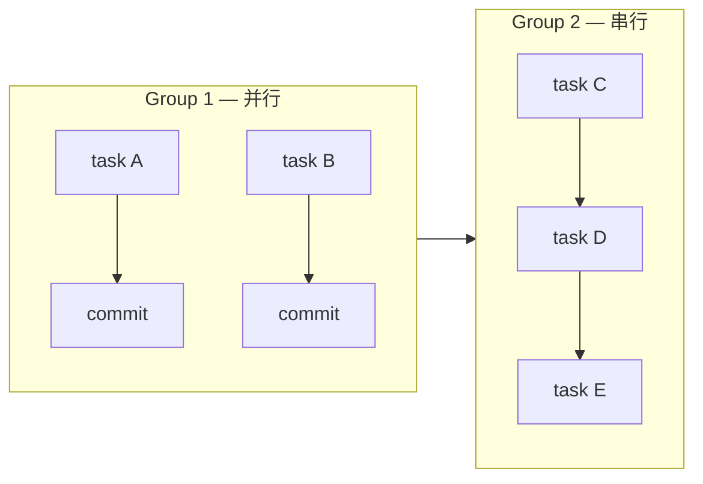

# 代码实现

按 tasks.md 执行代码实现。TDD 强制执行：type:behavior 任务走 RED→GREEN→REFACTOR 协议，其他类型直接实现。由 specwf-executor agent 负责执行。

## 步骤

### 步骤 1：检查状态

```bash
specwf state
```

确认当前状态是否可执行本步骤。

### 步骤 2：获取上下文

```bash
specwf context apply
```

读取输出的文件清单。


## 子代理

### 子代理类型
`specwf-executor`（完整 system prompt 见 `.omp/agents/specwf-executor.md`）

### 子代理提示词结构

派发时，提示词应包括：

```
子代理类型: specwf-executor
描述: 代码实现 — 按 tasks.md 执行，TDD RED→GREEN→REFACTOR

【项目上下文】
- 从 state.md 获取当前 change 标识
- 从 design.md 获取技术方案
- 从 tasks.md 获取任务清单
- 从 delta-specs 获取规格约束

【本次职责】
- 按 tasks.md 的 wave 顺序依次实现
- type:behavior 走 RED→GREEN→REFACTOR
- 每个 task 原子提交
- 所有 wave 完成后写 change-summary

【约束条件】
- 不跳过任何 task
- 遇到架构级变更时暂停并提问
```

### 产出物

|产出|说明|
|---|---|
|代码变更|按 tasks.md 实现|
|测试|与源文件同目录 *.test.ts|
|summary.md|specwf template change-summary|

| | |
|---|---|
| **描述** | 代码实现 — 按 tasks.md 执行，TDD RED→GREEN→REFACTOR |
| **执行 agent** | 派发 specwf-executor 子代理：<br>- 按 tasks.md wave 顺序实现代码<br>- type:behavior 任务走 RED→GREEN→REFACTOR<br>- 所有 wave 完成后写 change-summary |
| **产出** | 代码变更 + 测试 + summary.md |
| **产出模板** | `specwf template change-summary` |
| **上下文** | `specwf context apply` + `specwf state` |
| **参数** | `change <name>` — 指定要实现的 Change。不传时查看 `specwf state` 待处理列表。 |
| **推进** | `specwf continue` |
| **引用技能** | `skills/specwf-apply/SKILL.md` |

## 执行流程

### 1. 读取上下文

运行 `specwf context apply` 获取设计、任务、规格：

- design.md — 技术方案
- tasks.md — 实现清单（标注 type:behavior / config / refactor / docs / scaffolding）
- delta-specs — 行为契约（SHALL / MUST 约束）
- 依赖的 specs/ — 已有全局规范

### 2. 任务分组与并发

依据 tasks.md 的依赖关系对 task 分组：

**组内串行** — 有依赖关系的 task 按顺序执行。
**组间并行** — 无依赖的 task 由多个 executor agent 并发执行。



### 3. TDD 执行协议（type:behavior）

每个 type:behavior 任务严格分三步：

**RED** — 写一个明确断言 delta-spec 行为的失败测试
- 测试必须可运行（不能编译/语法失败）
- 测试必须真实失败（断言不通过）
- 聚焦一个具体行为，不涉及实现细节
- 提交：`test(<scope>): RED - <描述>`

**GREEN** — 写最小实现使测试通过
- 只写让测试通过的代码，不多写
- 允许临时写法（REFACTOR 阶段清理）
- 提交：`feat(<scope>): GREEN - <描述>`

**REFACTOR** — 重构改进代码质量
- 不改变外部行为
- 消除重复、改进命名、提取函数
- 重构后确认所有测试仍然通过
- 提交：`refactor(<scope>): REFACTOR - <描述>`

### 4. 非 TDD 任务（type:config/refactor/docs/scaffolding）

直接实现，单次提交：

| type | 提交格式 | 示例 |
|------|----------|------|
| config | `config(<scope>): <描述>` | `config(eslint): add no-console rule` |
| refactor | `refactor(<scope>): <描述>` | `refactor(core): extract validateInput helper` |
| docs | `docs(<scope>): <描述>` | `docs(api): add JSDoc to public methods` |
| scaffolding | `chore(<scope>): <描述>` | `chore(auth): create AuthService skeleton` |

### 5. 原子提交协议

- 每个提交是一个逻辑单元，可独立 review
- RED / GREEN / REFACTOR 每个阶段至少一个提交
- 不混合不同 task 的改动在一个提交中
- 提交消息使用 Conventional Commits 格式

### 6. 偏差处理

| 场景 | 处理方式 |
|------|---------|
| 发现未在 tasks.md 中的 bug | 自动修复，commit 标注 `[auto-fix]` |
| 所需辅助代码缺失 | 自动补充，commit 标注 `[auto-add]` |
| 构建/依赖/环境阻塞 | 尝试 3 次修复，失败后暂停并提问 |
| 需要架构级变更 | 暂停并输出变更方案等待确认 |

**分析瘫痪防护**：连续 5 次读操作后无写操作时，自动输出诊断报告。

### 7. Wave 完成检查

- [ ] wave 内所有 task 已完成
- [ ] 所有 type:behavior task 通过 RED→GREEN→REFACTOR 完整闭环
- [ ] 实现符合 delta-spec 的 SHALL / MUST 约束
- [ ] 类型检查通过（tsc --noEmit / 对应工具）
- [ ] 测试全部通过（vitest run）
- [ ] 无 lint / 类型错误
- [ ] 每个提交是原子的，commit message 格式符合规范

### 8. 产出总结

所有 wave 完成后，使用模板生成 change summary：

```bash
specwf template change-summary --name <change-name> --dir specwf/changes/<change-name>
```

生成 summary.md 包含：intent、产出文件清单、关键决策、验证结果。

